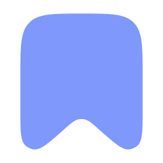
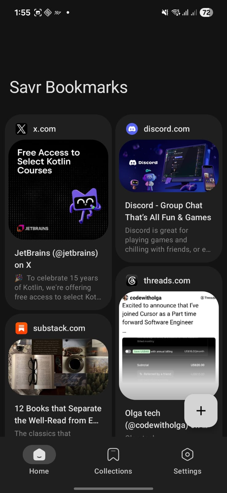
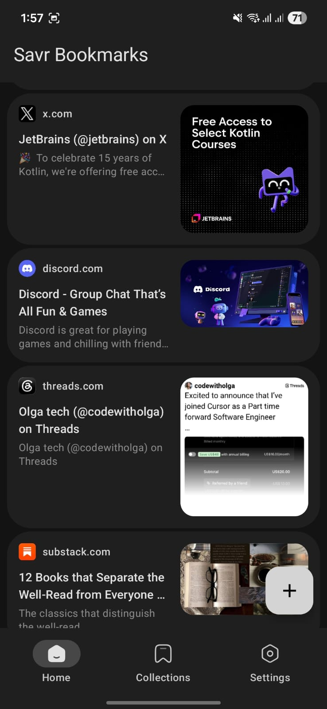
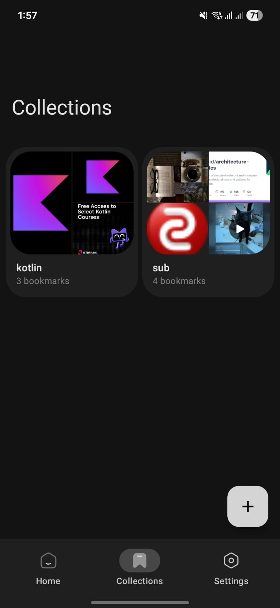
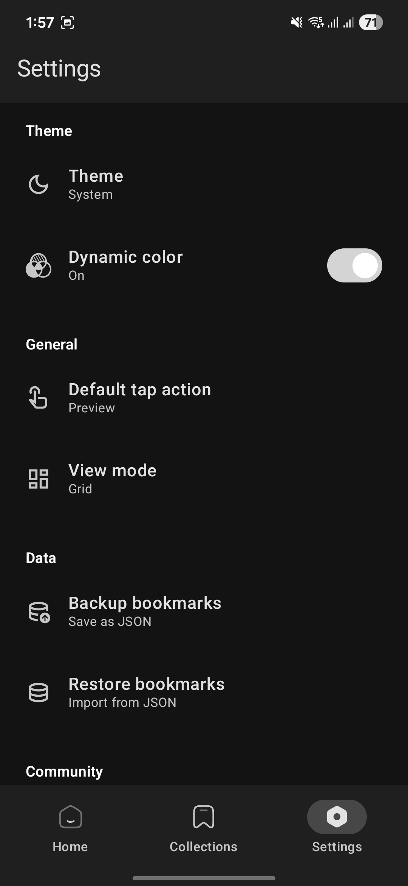
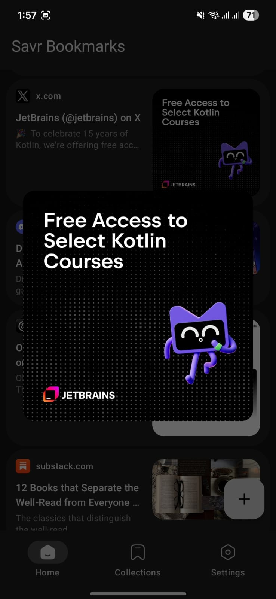
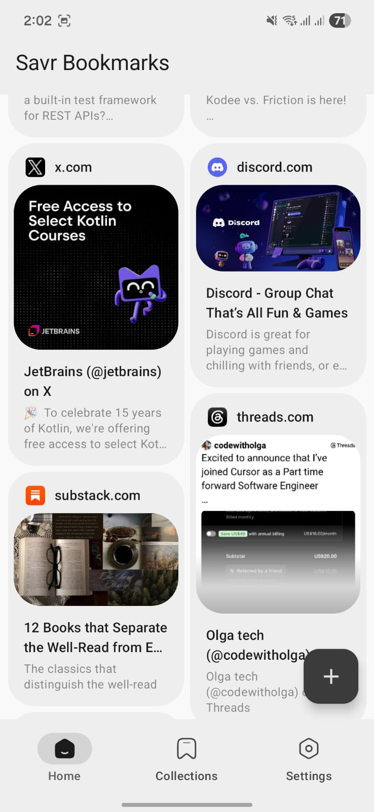

# Shelf - Save links worth keeping

> Fork of [Savr](https://github.com/qeiq/Savr) by [qeiq](https://github.com/qeiq), licensed under GPLv3.

---

  

<h1 align="center">Savr</h1>

  A no-nonsense bookmark app for Android. Paste a link. That's it.

  

---

## About

Every bookmark app I tried was either crammed with stuff I'd never use or wanted me to pay monthly just to save a URL. So I built the thing I actually wanted: drop a link, grab the metadata, move on. No signups, no cloud, no tracker pestering you.

## Features

- **Auto Metadata** — Paste any URL and Savr grabs the title, description, and preview image automatically.
- **Collections** — Group bookmarks without nested folders. Name it, throw links in, move on.
- **Selection Mode** — Long-press a bookmark, then batch delete or move multiple at once.
- **Quick Preview** — Tap any bookmark to see what's inside before opening it in your browser.
- **Search** — Search through all your bookmarks by title or URL.
- **Sort** — Sort by date added or alphabetically, ascending or descending.
- **Custom Tap Action** — Set a single tap to preview, open in browser, or copy the link.
- **Grid or List** — Cards or a compact list. Flip between them whenever.
- **Export** — Export your data as JSON or HTML.
- **Import** — Import from JSON or HTML files, including browser bookmark exports.
- **Auto Backup** — Automatic daily backup to your Downloads folder.
- **Material You** — Matches your wallpaper. Light, dark, or system default.

## Previews

| Home (Grid) | Home (List) | Collections |
|:---:|:---:|:---:|
|  |  |  |

| Settings | Image Preview | Light Theme |
|:---:|:---:|:---:|
|  |  |  |

## Stack

| | |
|---|---|
| **Language** | Kotlin |
| **UI** | Jetpack Compose + Material 3 |
| **Architecture** | MVI + StateFlow |
| **DI** | Koin |
| **Database** | Room |
| **Networking** | OkHttp, Jsoup |
| **Images** | Coil |

## Credits

Metadata parsing powered by [Android-Link-Preview](https://github.com/vishalkumarsinghvi/Android-Link-Preview) by Vishal Kumar Singhvi.

## License

This project is licensed under the GNU General Public License v3.0. See the [LICENSE](LICENSE) file for details.

## Found a bug? Got an idea?

[Open an issue](https://github.com/qeiq/Savr/issues). Or just say hi — I don't bite.

If this app saves you even one headache, a star would mean a lot.
