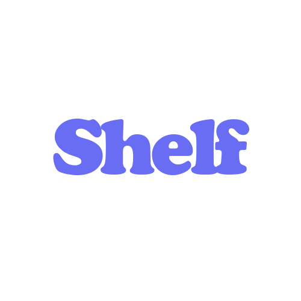

  

    
  
  <h4>The links you love. Beautifully organized. Entirely yours.</h4>

   
  
  

 

I was tired of bookmark apps that felt like a chore. The ones packed with features I didn't ask for, or the ones hiding behind subscriptions just to save a URL. 

I wanted something clean. Something instant. So I took the brilliant foundation of an open-source app called Savr, and began crafting the exact tool I wanted on my home screen. 

Shelf is designed to do exactly one thing, flawlessly: **drop a link, grab the details, and move on.** 

No sign-ups. No cloud lock-in. No trackers. Just you and the links that matter.

---

## Features that feel like magic

**✨ Instant Metadata**  
Paste a URL, and watch Shelf instantly pull in the title, description, and a high-quality preview image. It just works.

**🚀 Direct Share Integration**  
Found something interesting in Chrome, Twitter, or Reddit? Just hit "Share" and send it straight to Shelf. It's saved in a split second without even opening the app.

**🗂️ Collections. Perfected.**  
Group your bookmarks naturally. No messy nested folders—just name a collection, drop your links in, and find them effortlessly later.

**🎨 Designed for your screen**  
Built with pure Material 3 and tailored for Android. Switch seamlessly between Light, Dark, or true OLED Black themes. Make it yours by choosing from 8 beautifully curated accent colors.

**⚡ Lightning Fast Actions**  
Configure exactly what happens when you tap a link. Open it directly in your browser, bring up a quick preview card without leaving the app, or instantly copy the URL to your clipboard.

**📱 View it your way**  
Prefer a visual spread or a dense list? Toggle effortlessly between Grid and List view to browse your collection however you like.

**🔍 Search that actually works**  
Find exactly what you're looking for, the moment you need it. Instant search across titles and URLs.

**🔄 Your data. Your rules.**  
You own your bookmarks. Export them to JSON or HTML anytime. Import from your desktop browser just as easily. Works completely offline, prioritizing your privacy.

**💾 Peace of mind, built-in**  
Rest easy with automatic, daily backups saved straight to your device's internal storage and downloads folder. You never lose a thing.

---

## Under the Hood

Crafted with modern Android engineering.

| Category | Technology |
| :--- | :--- |
| **Language** | Kotlin 💜 |
| **UI** | Jetpack Compose + Material 3 |
| **Architecture** | MVI + StateFlow |
| **Database** | Room |
| **Networking** | OkHttp, Jsoup |
| **Images** | Coil |

---

## Acknowledgements

First and foremost, the core of this application was built by **[qeiq](https://github.com/qeiq)** in their amazing project **[Savr](https://github.com/qeiq/Savr)**. Shelf is a fork of Savr, and without their fantastic open-source codebase, this project wouldn't exist. 

A massive thank you to **Vishal Kumar Singhvi** for [Android-Link-Preview](https://github.com/vishalkumarsinghvi/Android-Link-Preview), which powers the metadata magic.

---

## Open Source

Proudly open-source and licensed under the **GNU General Public License v3.0**. See the [LICENSE](LICENSE) file for the fine print.

## Say Hello

Found a bug? Have an idea that could make Shelf even better? I'd love to hear it.  
👉 [Open an issue](https://github.com/iambhvsh/shelf/issues) and let's chat.

⭐ *If Shelf helps keep your digital life a little more organized, a star on GitHub goes a long way.*
